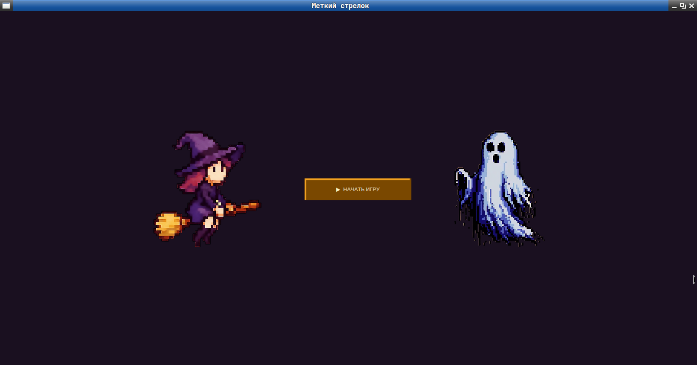
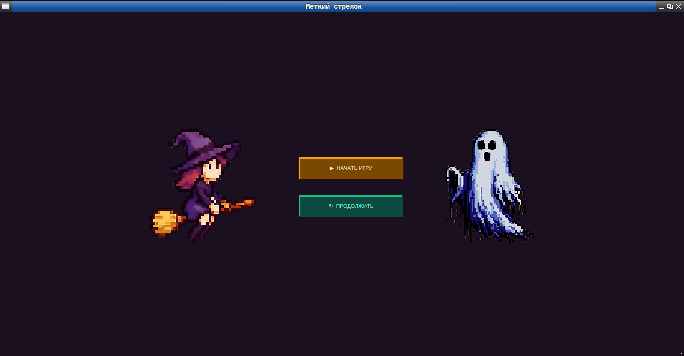
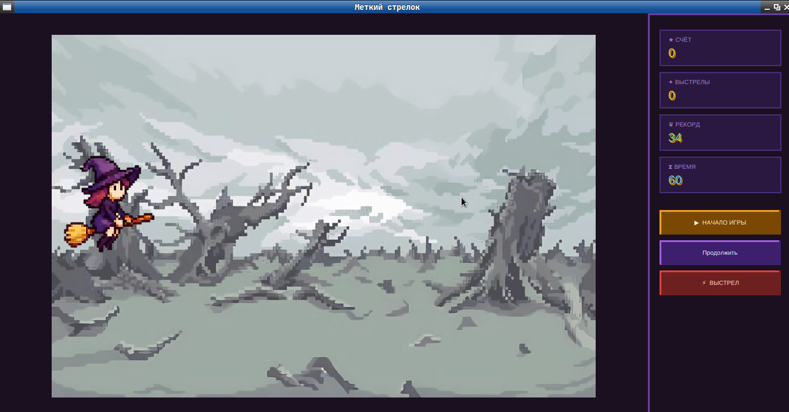
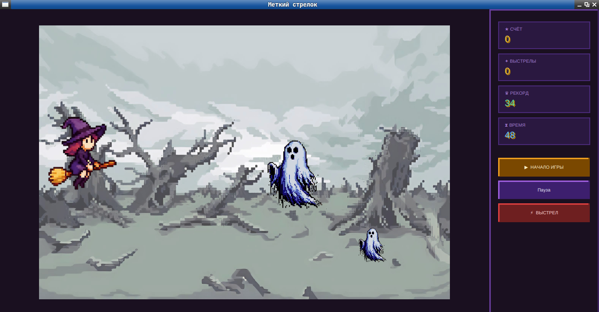
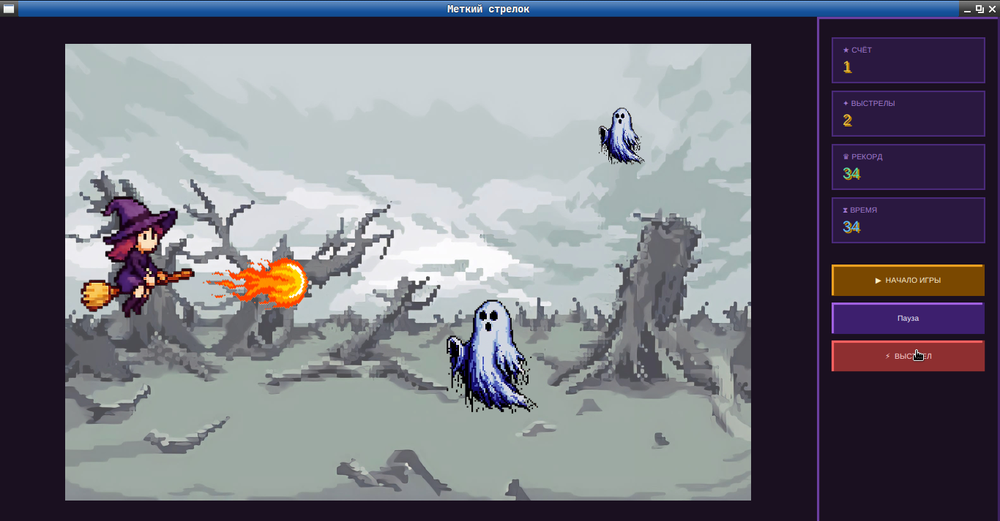
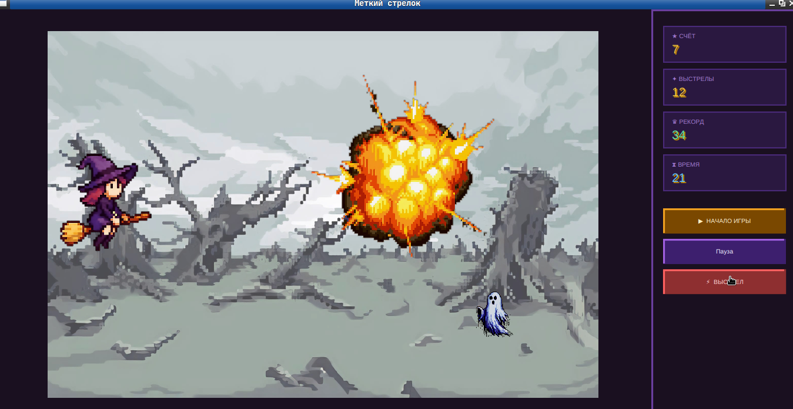
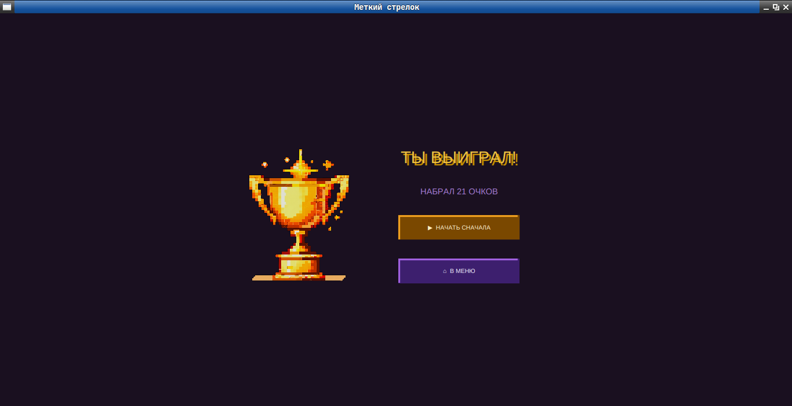
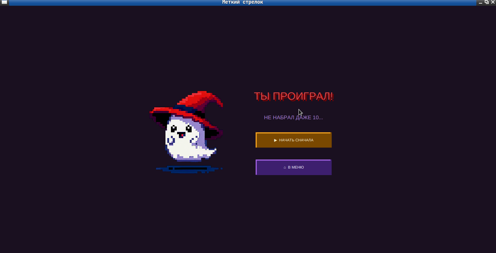

# Marksman

> Стрелковая игра на меткость — поражай движущиеся мишени и устанавливай рекорды за отведённое время.

---

## Описание и правила

Игрок управляет лучником и должен поразить как можно больше мишеней за **60 секунд**.

На поле одновременно присутствуют две мишени:
- **Ближняя** — крупная, медленная, даёт **1 очко**
- **Дальняя** — меньше, быстрее, даёт **2 очка**

Мишени непрерывно движутся по вертикали. После попадания цель исчезает с анимацией взрыва и через короткое время появляется снова. Игру можно приостановить в любой момент — прогресс сохраняется и доступен при следующем запуске. Лучший результат фиксируется между сессиями.

---

## Скриншоты

### Главное меню

<div align="center">

| Новая игра | Доступно сохранение |
|:---:|:---:|
|  |  |

</div>

---

### Игровой процесс

<div align="center">

| До начала | Во время игры |
|:---:|:---:|
|  |  |

| Выстрел | Попадание |
|:---:|:---:|
|  |  |

</div>

---

### Экран окончания

<div align="center">

|              Победа              |              Поражение               |
|:----------------------------------:|:--------------------------------------:|
|  |  |

</div>

---

## Структура проекта
```md
src/
    ├── main/
    │   ├── java/com/marksman/
    │   │   ├── controller/
    │   │   │   ├── GameController.java       # игровая логика: очки, выстрелы, таймер
    │   │   │   ├── GameOverController.java   # контроллер экрана окончания игры
    │   │   │   ├── GameViewController.java   # основной контроллер игры, game loop
    │   │   │   └── MenuController.java       # контроллер главного меню
    │   │   ├── entity/
    │   │   │   ├── Arrow.java                # стрела — отдельный поток, перемещается по горизонтали
    │   │   │   └── Target.java               # мишень — отдельный поток, движется независимо
    │   │   ├── model/
    │   │   │   ├── GameState.java            # состояние игры, персистентное хранение
    │   │   │   └── SaveManager.java          # управление сохранением и загрузкой прогресса
    │   │   ├── view/
    │   │   │   └── GameField.java            # холст Canvas, отвечает исключительно за отрисовку
    │   │   ├── Main.java                     # точка входа в приложение
    │   │   └── SceneManager.java             # переключение сцен приложения
    │   └── resources/com/marksman/
    │       ├── images/                       # графические ресурсы: герой, мишени, стрела, взрыв, фон
    │       ├── game.fxml                     # разметка игрового экрана
    │       ├── gameOverView.fxml             # разметка экрана окончания игры
    │       ├── menuView.fxml                 # разметка главного меню
    │       └── marksman.css                  # стили пользовательского интерфейса
```

---

## Реализация

Проект разработан на **Java 17 + JavaFX** в рамках учебного курса.

**Архитектура** построена по паттерну **MVC**: контроллеры инкапсулируют логику взаимодействия, `GameField` отвечает исключительно за визуализацию, `GameState` централизованно хранит и персистирует данные игры.

**Многопоточность** — движение мишеней и стрелы реализовано через `Thread`. Каждый игровой объект обновляет свои координаты в собственном потоке с интервалом 16 мс, независимо от основного потока приложения.

**Игровой цикл** построен на `AnimationTimer` с частотой ~60 кадров в секунду. На каждой итерации холст полностью очищается и все объекты перерисовываются в актуальных позициях.

**Сохранение прогресса** реализовано через `java.util.prefs.Preferences` — стандартный механизм Java для хранения пользовательских данных без явной работы с файловой системой.

---

## Запуск

```bash
# Требуется Java 17+ и JavaFX
./mvnw javafx:run
```

---

## Технологии

- Java 17
- JavaFX
- FXML + CSS
- java.util.prefs.Preferences
---
## Автор

> Разработано в рамках лабораторной работы по дисциплине "Разработка сетевых приложений на Java".  
> Сделано студенткой Шакировой Есении по заданному ТЗ (немного усовершенствовала)
